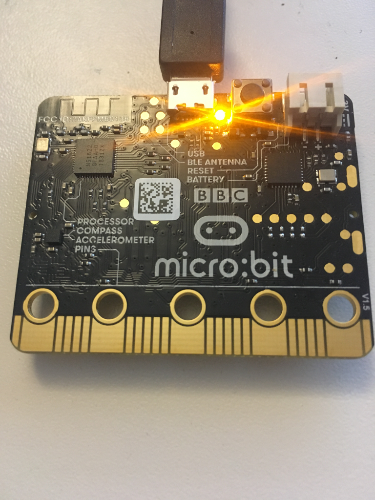

+++
title = "Rust on the BBC micro:bit"
description = "The BBC micro:bit is a popular development kit often used to teach kids how fun programming can be. Lets see how we can hook it up to the cloud"
extra.author = "lulf"
+++

The BBC micro:bit is a popular development kit often used to teach kids how fun programming can be. Version 1.x of the kit features a nRF51822 micro-controller, a motion sensor, accelerometer, and a 5x5 LED matrix. The recently released v2.0 upgrades the micro-controller to an nRF52833, which gives twice the flash and the RAM in addition to a speaker and microphone.

In this post, you will see how to get started using Rust on the micro:bit. We'll expose the on-chip thermometer as a Bluetooth Environment Sensing Service, and write a small application (in rust, duh), that polls the sensor for data and publishes it to the Drogue Cloud via a Bluetooth gateway.

The micro:bit does not have a lot of RAM (only 16k!), so we won't be doing any fancy encryption just yet.



## The micro-controller

The nRF family of microcontrollers are generally built for 2.4 GHz low power radio, such as [Bluetooth Low Energy (BLE)](https://en.wikipedia.org/wiki/Bluetooth_Low_Energy), [ZigBee/802.15.4](https://en.wikipedia.org/wiki/IEEE_802.15.4) and some proprietary protocols.

Unlike some other BLE chips, the nRF 51 and 52 families used in the micro:bit runs the BLE stack alongside the application code in different parts of memory. Nordic Semiconductor (the company making the nRF) provides a proprietary firmware with the BLE implementation that you can use. However, you are also free to use that memory for something else, or provide your own BLE stack (and that is what we will do in this blog post). The advantage of this design is power saving since there is less active circuitry needed to operate the microcontroller. THe disadvantage is that you have to deal with flashing the BLE firmware as well and have to use an in-memory interface for communicating with the BLE controller.

Bluetooth Low Energy is a wireless network technology aimed at low-power applications. The advantage is that devices can operate on coin cell batteries for a long time while still providing some functionality. The BLE standard is huge, and is a bit special in that it covers a lot of what one would consider the 'application layer' standards such as standard formats for thermometers, heart rate monitors, audio and more. The advantage is that BLE-compatible software can work with BLE-compatible hardware from multiple vendors.


## Rust and BLE

For BLE on nRF using Rust, there are two options:

* Use the [rust bindings](https://github.com/akiles/nrf-softdevice) for the nRF firmware.
* The [rubble](https://github.com/jonas-schievink/rubble) project, which is an open source pure rust implementation of the BLE standard. It's important to note that the rubble stack has not gone through the Bluetooth Qualification Process, so you cannot make bluetooth-based products with it at present.

In this post, we'll use rubble, because open source is the one true way.

## Connecting to the cloud

To connect BLE devices to the cloud, some sort of gateway software is needed. There are alternatives like [Eclipse Kura](https://www.eclipse.org/kura/) that provides a lot of functionality.

We'll use a proof of concept [drogue-bluetooth-gateway](https://github.com/drogue-iot/drogue-bluetooth-gateway), which should work out of the box on most Linux distributions. The idea is that this can run on a gateway device like Raspberry PI and forward data to the cloud. The gateway talks to the bluetooth daemon (BlueZ) using DBus, and needs to run as a priviledged container.

To deploy the cloud, have a look at [drogue-cloud](https://github.com/drogue-iot/drogue-cloud) which you can run locally on [minikube](https://github.com/kubernetes/minikube/releases).

## The code

The example used in this blog post can be found at the [drogue-microbit](https://github.com/drogue-iot/drogue-microbit/tree/main/examples/ble-thermometer) repository. This repository contains some libraries and example applications for the micro:bit based on the [nrf-hal](https://github.com/nrf-hal/nrf-hal). An alternative crate to use is the [microbit](https://crates.io/crates/microbit) crate, which re-exports on nrf-hal + some libraries.

The example uses [RTIC](https://rtic.rs), which provides a useful abstraction for writing embedded rust application.

### Configuring the BLE stack

Rubble needs to be configured with:

* An implementation of a Transmitter trait. Rubble comes with a BleRadio type that consumes the radio device as well as TX/RX packet buffers.
* A timer that is used to drive the link layer state. The micro:bit features a timer that we can use for this purpose.
* A set of buffers and queues which is used to pass data between the radio, link layer and attribute protocol.
* A BLE channel mapper that exposes attributes that map to the GATT service we're implementing.
  
```rust
pub enum AppConfig {}
impl Config for AppConfig {
    type Timer = BleTimer<hal::pac::TIMER0>;
    type Transmitter = BleRadio;
    type ChannelMapper = BleChannelMap<EnvironmentSensingService, NoSecurity>;
    type PacketQueue = &'static mut SimpleQueue;
}
```
  
The BLE service that most closely matches our use case is the Environment Sensing Service, so we'll use that. It allows exposing different types of environment data such as temperature, humiditiy along with some metadata. In theory, an application relying on this standard can be interoperable with any device implementing this service.

```rust
let ess: EnvironmentSensingService = EnvironmentSensingService::new();

let ble_r = Responder::new(tx, rx, L2CAPState::new(BleChannelMap::with_attributes(ess)));
```

In order for a BLE device to be known to the world, it must advertise its existence. It does so by broadcasting advertisements, so that those interested can discover it. The broadcast is done at regular intervals, usually called the advertisement interval. In the example application it's set to 100 milliseconds, which makes it pretty easy to discover. The advertisement also contains some metadata about the broadcaster, in our case a name of the device along with the UUIDs corresponding to the service that the device supports.

```rust
let next_update = ble_ll.start_advertise(
        Duration::from_millis(100),
        &[
            AdStructure::CompleteLocalName("Drogue IoT micro:bit"),
            AdStructure::ServiceUuids16(ServiceUuids::from_uuids(true, &[ESS_UUID])),
        ],
        &mut radio,
        tx_cons,
        rx_prod,
    )
    .unwrap();
ble_ll.timer().configure_interrupt(next_update);
```

Rubble needs to act on RADIO interrupts to handle received data.

```rust
#[task(binds = RADIO, resources = [radio, ble_ll], spawn = [ble_worker], priority = 3)]
fn radio(ctx: radio::Context) {
    ...
}
```

It also requires to ensure that connection events can be processed at regular intervals.

```rust
#[task(binds = TIMER0, resources = [radio, ble_ll], spawn = [ble_worker], priority = 3)]
fn timer0(ctx: timer0::Context) {
    ...
}
```

Both of these spawn another task which does all the work:

```rust
while ble_r.has_work() {
    ble_r.process_one().unwrap();
}
```

This can in theory run in the idle loop as well, but this way it is only run when needed (via radio or timer interrupts).


### Measuring the temperature

To avoid conflict with the RADIO and TIMER0 interrupts, a Real Time Counter (RTC) is used to periodically measure the temperature
and update the temperature state of the environment sensing service. The temperature is measured by first starting the measurement, then waiting for a while to
make sure the value is stable, then reading the value and stopping the measurement.


```rust
#[task(binds = RTC0, resources = [rtc, thermometer, timer_count, ble_r], priority = 1)]
fn rtc0(ctx: rtc0::Context) {

    ...

    if *timer_count % 2 == 0 {
        thermometer.start_measurement();
    } else {
        let value = thermometer.read();
        value.map_or_else(
        |_| {},
        |value| {
                // Our calibration shows that it is off by 4 degrees...
                let f = value.to_num::<u32>() - 4;
                ble_r.lock(|ble_r| {
                    let l2cap = &mut *(ble_r.l2cap());
                    let provider: &mut EnvironmentSensingService =
                        l2cap.channel_mapper().attribute_provider();
                    provider.set_temperature(f);
                });
            },
        );
        thermometer.stop_measurement();
    }
}
```


## Running the application

If you've connected the micro:bit to your PC, you can flash your device using `cargo embed --release`. This will start up a console printing log messages from the firmware:


## Connecting and reading the data


To run the gateway, you need to have `podman` or `docker` installed. You can run the gateway using a prebuilt container image:

```shell
docker run --privileged --volume /run/dbus/system_bus_socket:/run/dbus/system_bus_socket --net=host -e RUST_LOG=info -e DROGUE_HTTP_ENDPOINT=http://http-endpoint.drogue-iot.172.18.0.2.nip.io:30394 -e DROGUE_USERNAME=ble_gw -e DROGUE_PASSWORD=foobar -e BLUETOOTH_DEVICE=B9:64:39:0E:8E:DF -ti quay.io/lulf/drogue-bluetooth-gateway:latest
```

You can find the address in the console output from the device. The gateway should be able to connect to your device and publish data to the cloud:


If the gateway is able to connect to your device, we can see some output in the drogue console:


And thats it! 

## Whats next

We've seen how you can develop open source BLE applications in rust on the BBC micro:bit and sending telemetry data to the cloud via a BLE gateway. However, we have only scratched the surface of what you can do with it There are more interesting sensors on the micro:bit to play with, like the motion sensor and the mic/speaker on the v2.

The rubble stack is not completely reliable, and difficulties connecting to the device and disconnects does occur. Working out the root cause for these issues would improve the relability of the example.

There are several alternatives to use as BLE gateways, such as Eclipse Kura that it could be interesting to try. It would also be nice to have support for [6LoWPAN](https://en.wikipedia.org/wiki/6LoWPAN) in rubble, so that BLE devices can be directly connected using IPv6.
