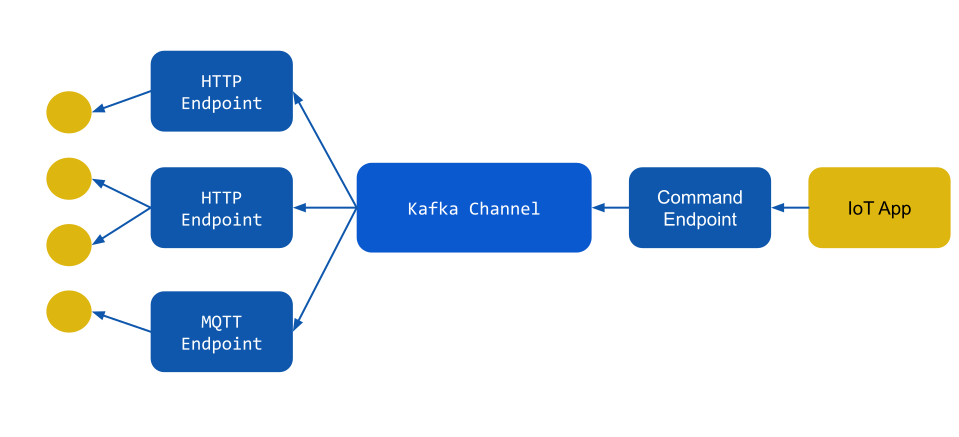

+++
title = "Command your devices"
description = "Sending commands to your devices using Knative eventing"
extra.author = "dejanb"
+++

So far when we talked about serverless IoT cloud we focused only on one way communication, devices sending *telemetry* data to the cloud.
But in order to have a complete IoT solution, we need to be able to control our devices as well, by sending *commands* back to them.

<!-- more -->

# Introduction to commands

Communication patterns between devices and clouds have been well known for a long time. IoT is all about sensing the physical world and controlling it
using our devices and backend solutions. So our devices are behaving both as *sensors*, generating telemetry data for cloud to consume and *actuators*,
controlling the environment by processing commands (usually sent by the cloud solution). 

Even if these two communication patterns look similar at the first glance, there are some big differences between them.
Telemetry data are usually large in volume and they can be considered as a single event stream. In other words, we are not interested in consuming data of a single 
device. That is why telemetry use case is a perfect fit for the Knative eventing as we can collect data from all our devices using different endpoints (and multiple instances of endpoints)
and put them into the single *channel* (backed by Kafka topic). Our cloud services will then consume all these data and send them for further processing.

Commands on the other hand are much smaller in volume, making them easier to handle. But at the same time commands are very targeted, as we're sending a command to a 
particular device to perform certain action. In order to do so, the command needs to be consumed only by that one device (out of millions of other devices). To complicate things further, these devices are connected through different endpoints and can be even offline. We also need to think about different delivery guarantees and command acknowledgments as we will discuss a bit later.

# Implementation

Having all this in mind, let's try to implement commands with our serverless IoT stack.



First of all we need a new service that will be used as an API by IoT applications to send commands. Let's call it *command endpoint*. As with the telemetry case, this endpoint will transform POST payloads to cloud events and send all commands to the dedicated Kafka channel.

Now let's consider the scenario from the diagram, where devices are connected to different "device endpoints" (and different instances of those endpoints). 
In the current scenario, as we don't know where the device might be connected (if at all), all our endpoints need to subscribe to the channel and receive every command. Then, based on their internal knowledge they can deliver the command to the appropriate device or drop it if the device is not connected to them. 
This is a bit suboptimal as only one endpoint will actually deliver the message and everyone else will discard it. But remember, commands are low-volume traffic so event this solution can scale to large number of devices (and endpoints). And of course, this is just first implementation and we can improve on top of this design in the future.

# Examples

So, how all this look in practice? When you get the status of the Drogue cloud now, with

```shell
./hack/status.sh
```

You'll see the new section with all important information about commands

```shell
Send commands to the device
---------------------------

After you created a device, try these commands at a shell prompt:

Publish data from the device and specify how long will you wait for a command with 'ttd' parameter (in seconds)

  http --auth device_id:foobar POST http://http-endpoint.drogue-iot.10.101.208.153.nip.io/publish/device_id/foo?ttd=30 temp:=42

Or subscribe with the MQTT device

  mqtt sub -v -h 192.168.64.28.nip.io -p 30880 -u device_id -pw foobar -i device_id -s --cafile tls.crt -t cmd -V 3

Send command to that device from another terminal window:

 http POST http://command-endpoint.drogue-iot.10.101.208.153.nip.io/command/device_id/foo set-temp:=40
 ```

Here, you can see how to *subscribe* to receive commands from your devices and also how to send commands to them by simply POSTing to the appropriate command endpoint URL.

Interesting thing to discuss here is the *ttd* parameter needed in order to receive a command for a device using HTTP protocol. This is because, unlike MQTT, HTTP is not connection oriented protocol. Meaning that device will not keep a permanent connection to the cloud on which it can receive commands as they come. Specifying TTD (Time till disconnect) while sending telemetry will make the client wait for the specified number of seconds (30 in the example above) for cloud to send a command. This will usually trigger a backend solution (digital twin) to try to deliver a command to the device while it's connected.

```shell
$ http --auth device_id:foobar POST http://http-endpoint.drogue-iot.10.101.208.153.nip.io/publish/device_id/foo?ttd=30 temp:=42
HTTP/1.1 202 Accepted
date: Thu, 21 Jan 2021 12:05:15 GMT
server: envoy
transfer-encoding: chunked
x-envoy-upstream-service-time: 3140

{"set-temp": 40}
```

On the other hand, devices connecting using MQTT have a much simpler task. They just need to *subscribe* to a designated topic and will receive commands as they are sent by the application.

```shell
$ mqtt sub -v -h 192.168.64.28.nip.io -p 30880 -u device_id -pw foobar -i device_id -s --cafile tls.crt -t cmd -V 3
Picked up _JAVA_OPTIONS: -Dvertx.disableDnsResolver=true
Identifier 'device_id' may contain invalid characters ('_')
Client 'device_id@192.168.64.28.nip.io' sending CONNECT MqttConnect{keepAlive=60, cleanSession=true, simpleAuth=MqttSimpleAuth{username and password}}
Client 'device_id@192.168.64.28.nip.io' received CONNACK MqttConnAck{returnCode=SUCCESS, sessionPresent=false}
Client 'device_id@192.168.64.28.nip.io' sending SUBSCRIBE MqttSubscribe{subscriptions=[MqttSubscription{topicFilter=cmd, qos=EXACTLY_ONCE}]}
Client 'device_id@192.168.64.28.nip.io' received SUBACK MqttSubAck{returnCodes=[SUCCESS_MAXIMUM_QOS_1]}
{"set-temp": 40}
Client 'device_id@192.168.64.28.nip.io' received PUBLISH ('{"set-temp": 40}') MqttPublish{topic=cmd, payload=16byte, qos=AT_LEAST_ONCE, retain=false}
```
Congratulations! You just sent your first commands to your devices.

# Future

We made our first foray into sending commands to devices using serverless infrastructure. But this is just a tip of the iceberg. Let's now discuss what future holds
and what we need to do to make it production ready.

### Security

First of all, we need to sort the security of the command endpoint (and cloud services in general) as we want to make sure that only appropriate applications
can receive telemetry and send commands to our devices.

### Quality of service

As it's implemented at the moment, commands are sent in the "fire and forget" manner. The application have no confirmation if the command was delivered, let alone 
executed by the device. This kind of commands are useful in some scenarios and much easier to implement (that's why we started there), but often you want a confirmation
whether the command is actually executed or not. For example, if you send a command to close the door you want to be sure that the door is closed as a result (or know that the command has failed). This kind of request-reply pattern requires some more design and implementation considerations (especially over the eventing infrastructure), but it's definitely a required feature and something we need to provide.

### Command buffering

Generally storing/queueing commands for million of devices in this layer is not advisable. Consider queueing commands for a device that has been offline for a long time. What's the "time to live" for those commands? Are subsequent commands executed in order? What's the state of the device after executing all previously queued commands?
The usual approach here is to use digital twin of the device to set the desired state of the device and the twin should try to apply that state to the device immediately.
You should think of it more in the terms of Kubernetes reconciliation loops rather than queuing systems.

However, some platforms allow temporary buffering of commands for offline devices, so we have to find a way to support it in a similar fashion.  

### Filter

As we've seen previously, at the moment all our device endpoints receive all the commands and then most of them are discarded. There's a lot of room for improvement there
and already proven patterns for solving these kind of use cases, so stay tuned for future improvements.

### More protocols

So far we only covered HTTP (in a so called long polling fashion) and MQTT, which are the most common protocols used for IoT. But there's a room for a lot more of them. Opening the system for web socket connections, gRPC, AMQP, Kafka, etc. would help grow the ecosystem substantially.

### Cloud events specification

As with the telemetry, the system uses *cloud events* as an internal events format. We should strive to create a common specification for the event format in this case as that could foster more integration options in the future.

As you can see, we are just scratching the tip of the iceberg here. There will be a lot of good stuff coming in this area. So keep an eye on this space and join us in developing it if that's what interests you.